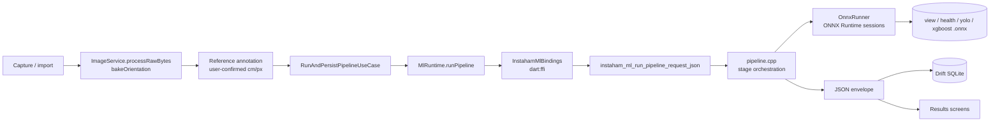

# Architecture

## Overview

INSTAHAM is a Flutter app that estimates a pig's live weight and assesses its health from a
single photograph. The user captures or imports an image, marks the two endpoints of a
reference object of known length, and confirms them; the app derives a cm/pixel scale from
that annotation alone. The image path and the scale are handed to a native C++ library
(`libinstaham_ml.so`) over `dart:ffi`, which runs the whole inference graph in one call —
view suitability, YOLO11s-seg segmentation, mask construction, health classification, and
the XGBoost weight regression — and returns a single JSON envelope. Dart decodes the
envelope, persists the scan to a local Drift/SQLite database, and routes the UI to a
result, uncertain, blocked, or reject screen depending on which branches succeeded. The
weight and health branches are independent: a failed weight branch never suppresses a
health assessment.

## Data flow

## Components

- **Flutter UI** (`lib/features/**/presentation`) — capture, reference marking, results.
  Holds no HTTP client and no ML runtime import; reads only decoded envelope fields.
- **Domain / use cases** (`lib/features/inference_pipeline/domain`) — decides whether a
  reference annotation is confirmed and coplanar enough to yield `cmPerPixel`, invokes the
  runtime, maps the envelope onto entities, and persists them.
- **MlRuntime** (`lib/services/ml/ml_runtime.dart`) — process-wide singleton. Stages the
  bundled `assets/ml/**` onto the real filesystem (native code needs paths, not asset
  handles), skipping files already present with a matching sha256, then creates the native
  context once. Chooses between the plain and request-shaped entrypoints.
- **FFI bindings** (`packages/instaham_ml_ffi/lib/`) — thin typed wrapper over the C ABI.
  Knows pointer lifetimes; knows nothing about the request or envelope schema.
- **C ABI** (`src/include/instaham_ml.h`) — the only externally callable surface. Compiled
  with `-fvisibility=hidden` plus an explicit `INSTAHAM_ML_API` attribute and a linker
  version script, so ONNX Runtime's and stb's symbols stay internal to the `.so`.
- **Pipeline orchestrator** (`src/pipeline.cpp`) — the only file that knows the stage order.
  Every stage-level failure is reported inside the envelope with its own status rather than
  aborting the call.
- **Stages** (`src/stages/`) — one file per stage: `segmentation`, `construction`, `cutter`,
  `feature_calculation`, `weight_prediction`. `construction` and the geometry headers link
  no ONNX Runtime, so they are unit-testable without a model.
- **Manifest** (`src/manifest.cpp`, `assets/ml/manifest.json`) — declares every model path,
  its sha256, preprocessing constants, class maps, feature order, and capability
  availability flags. Every referenced file's hash is verified before any ORT session is
  created. Class indices are never hardcoded; they come from `classes.json`.
- **ONNX Runtime** — four sessions: GhostNetV3 view classifier, GhostNetV3 health
  classifier, YOLO11s-seg segmenter, XGBoost weight regressor.

## Boundaries that matter

- **EXIF orientation is corrected exactly once**, in Dart at capture time
  (`ImageService.processRawBytes` → `img.bakeOrientation`). The native layer performs no
  rotation and assumes an already-normalised RGB image.
- **cm/pixel originates only from the user-confirmed reference object.** There is no
  implicit `k = 1.0` fallback anywhere in the native chain; a missing or unusable scale
  degrades the weight branch instead of predicting on unnormalised pixels.
- **The view classifier gates the graph.** `reject` stops the pipeline; `health_only` skips
  segmentation entirely (health's region protocols are stubs that degrade to full-frame, so
  the YOLO pass would feed nothing); `dorsal_valid` runs the full graph. An unrecognised or
  unavailable label fails closed — every downstream stage reports `skipped`.
- **One native call per scan.** The whole-graph entrypoint exists so the single constructed
  mask feeds both the health and weight branches instead of three per-capability calls each
  re-segmenting from the image path.
