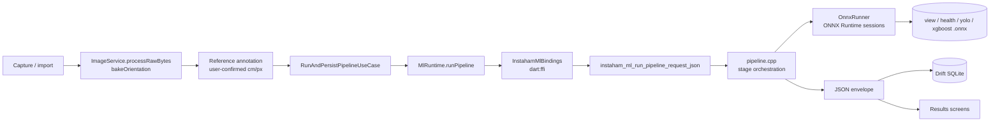

# Architecture

## Overview

INSTAHAM is a Flutter app that estimates a pig's live weight and assesses its health from a
single photograph. The user captures or imports an image, marks the two endpoints of a
reference object of known length, and confirms them; the app derives a cm/pixel scale from
that annotation alone. The image path and the scale are handed to a native C++ library
(`libinstaham_ml.so`) over `dart:ffi`, which runs the whole inference graph in one call —
view suitability, YOLO11s-seg segmentation, mask construction, health classification, and
the XGBoost weight regression — and returns a single JSON envelope. Dart decodes the
envelope, persists the scan to a local Drift/SQLite database, and routes the UI to a
result, uncertain, blocked, or reject screen depending on which branches succeeded. The
weight and health branches are independent: a failed weight branch never suppresses a
health assessment.

## Data flow

## Components

- **Flutter UI** (`lib/features/**/presentation`) — capture, reference marking, results.
  Holds no HTTP client and no ML runtime import; reads only decoded envelope fields.
- **Domain / use cases** (`lib/features/inference_pipeline/domain`) — decides whether a
  reference annotation is confirmed and coplanar enough to yield `cmPerPixel`, invokes the
  runtime, maps the envelope onto entities, and persists them.
- **MlRuntime** (`lib/services/ml/ml_runtime.dart`) — process-wide singleton. Stages the
  bundled `assets/ml/**` onto the real filesystem (native code needs paths, not asset
  handles), skipping files already present with a matching sha256, then creates the native
  context once. Chooses between the plain and request-shaped entrypoints.
- **FFI bindings** (`packages/instaham_ml_ffi/lib/`) — thin typed wrapper over the C ABI.
  Knows pointer lifetimes; knows nothing about the request or envelope schema.
- **C ABI** (`src/include/instaham_ml.h`) — the only externally callable surface. Compiled
  with `-fvisibility=hidden` plus an explicit `INSTAHAM_ML_API` attribute and a linker
  version script, so ONNX Runtime's and stb's symbols stay internal to the `.so`.
- **Pipeline orchestrator** (`src/pipeline.cpp`) — the only file that knows the stage order.
  Every stage-level failure is reported inside the envelope with its own status rather than
  aborting the call.
- **Stages** (`src/stages/`) — one file per stage: `segmentation`, `construction`,
  `quality_gates`, `cutter`, `feature_calculation`, `weight_prediction`. `construction` and
  the geometry headers link no ONNX Runtime, so they are unit-testable without a model.
  `quality_gates` (truncation, posture) runs on the whole mask in capture coordinates before
  the cutter, gated by two manifest switches that both ship `false`.
- **Vendor cutter/feature stack** (`src/vendor/instaham_v176/`) — the supplied C++
  implementation of the V176/V144 cut protocol and the 16-feature Chen16 vector, copied
  verbatim (per-file sha256 and every edit logged in its `VENDOR.md`). `stages/cutter.cpp`
  and `stages/feature_calculation.cpp` are thin adapters over it; nothing else calls into it,
  and its `cv::Mat` types never reach `pipeline.cpp`. Unconditionally OpenCV-dependent, so it
  compiles only under `INSTAHAM_ML_WITH_OPENCV` — now on for host builds too, not just
  Android, because `stages/cutter.cpp` is no longer header-only.
- **Manifest** (`src/manifest.cpp`, `assets/ml/manifest.json`) — declares every model path,
  its sha256, preprocessing constants, class maps, capability availability flags, and the
  weight branch's whole feature contract: `feature_family`, an arbitrary-width
  `feature_order`, and a `feature_domain` map keyed by feature name carrying each feature's
  trained bounds, `dimension`, and `gate` flag. Nothing native names a feature; the
  regressor's vector width is data, not code ([ADR-007](adr/007-manifest-declared-feature-family.md)).
  Every referenced file's hash is verified before any ORT session is created. Class indices
  are never hardcoded; they come from `classes.json`.
- **ONNX Runtime** — four sessions: MobileNetV4-Conv-Small view classifier (`view_v2`,
  replaced GhostNetV3 in docs/plan.md), GhostNetV3 health classifier, YOLO11s-seg
  segmenter, XGBoost weight regressor.

## Boundaries that matter

- **EXIF orientation is corrected exactly once**, in Dart at capture time
  (`ImageService.processRawBytes` → `img.bakeOrientation`). The native layer performs no
  rotation and assumes an already-normalised RGB image.
- **cm/pixel originates only from the user-confirmed reference object.** There is no
  implicit `k = 1.0` fallback anywhere in the native chain; a missing or unusable scale
  degrades the weight branch instead of predicting on unnormalised pixels. This boundary is
  also the highest-gain one: the weight regressor is effectively univariate in mask area
  ratio, which carries the scale squared, so a 1% scale error becomes a 2.8–4.0% weight
  error — see [pipeline/prediction-2.md](pipeline/prediction-2.md).
- **The view classifier gates the graph.** `reject` stops the pipeline; `health_only` skips
  segmentation entirely (health runs on the whole photo there, and without a mask it has no
  second stage to feed); `dorsal_valid` runs the full graph. An unrecognised or
  unavailable label fails closed — every downstream stage reports `skipped`. **The view
  gate is the one gate a user can override**, per-photograph and only by explicit choice
  ([adr/017](adr/017-user-consent-view-gate-override.md), widened by
  [adr/020](adr/020-view-route-override-either-route.md)): a `reject` can be sent down either
  the `health_only` or the `dorsal_valid` route, and a `health_only` can be raised to
  `dorsal_valid`. A `dorsal_valid` verdict is never changed. When the route changes, the
  envelope's `view` block carries `"override": true` and `"override_route"`. No other gate is
  overridable.
- **One native call per scan.** The whole-graph entrypoint exists so the single constructed
  mask feeds both the health and weight branches instead of three per-capability calls each
  re-segmenting from the image path.
- **Health can run the model twice in that one call.** The whole photo decides whether the
  pig is `Healthy`. Any other label is classified again on the masked pig, and that second
  result is final. The manifest switches this on (`health.cascade`), and with it off the
  output is the single pass exactly. See [pipeline/health.md](pipeline/health.md) and
  [ADR-019](adr/019-whole-photo-decides-healthy-masked-pig-rechecks.md).
- **That call blocks, but it blocks a worker isolate, not the UI one.**
  ([ADR-018](adr/018-native-calls-run-on-a-worker-isolate.md)) `MlRuntime` runs the three
  user-facing entrypoints — the whole-graph call, its request-shaped form, and the view gate —
  inside `Isolate.run`, and serializes every call through a single-slot `CallQueue` so at most
  one is ever in flight against the one native context. The whole graph is still one long
  synchronous C++ call; what changed is which thread waits on it.

  This matters because the wait is long: 11.7 s median on `tokay`, 17.0 s on `oriole`, 70.9 s
  on `lion` ([device-metrics-results.md](device-metrics-results.md)). Run on the UI isolate it
  pumped no frames for that whole window and sat inside Android ANR territory on low-tier
  hardware — the first field build with the real cutter was killed exactly that way, which is
  what [ADR-008](adr/008-unscaled-cutter-input-is-capped-not-gated.md) bounds. Two consequences
  follow for anyone touching this seam: `instaham_ml_last_error()` is `thread_local` and must
  be read inside the worker or it reads back empty, and callers must not bypass the queue.
  Both are contract, not style — see [ffi-bridge.md](ffi-bridge.md).

> Continued in [architecture-2.md](architecture-2.md) — the Flutter module layout: `lib/`
> boundaries, layering, naming conventions, and the single FFI seam.
