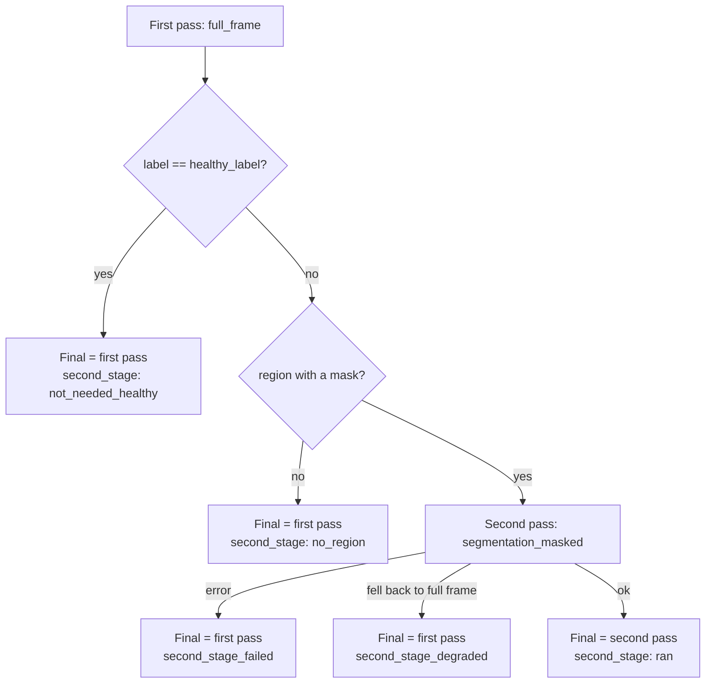

# Health classifier branch

The GhostNetV3-100 health classifier (`assets/ml/health/model.onnx`, 10 classes from
`health/classes.json`, `Healthy` plus nine conditions). The code is `src/classifier.cpp`
(`run_classifier()`, `run_health_cascade()`) and `src/health_input.cpp` (input protocols and
the second-stage decision). The tensor-level contract is in [../spec.md](../spec.md). This
file covers how the branch runs and why.

## Where it sits

Health runs on both the `dorsal_valid` and `health_only` routes, after segmentation and
construction, and before the weight branch's scale, cutter and feature stages. It is
independent of the weight branch: a failed weight stage never suppresses a health result
(AGENTS.md rule 4), and a health failure never blocks weight.

## Input protocols

`prepare_health_input()` turns the decoded photo, plus an optional pig region, into the
224×224 crop the model takes. Every path ends in the same resize-shorter-side-255 /
centre-crop-224 step the view classifier uses.

| Protocol | What the model sees | Status |
|---|---|---|
| `full_frame` | The whole photo | Shipped first pass (`health.input.protocol`) |
| `segmentation_crop` | The pig's box, padded by `bbox_padding_ratio` (0.06), background kept | Implemented (`docs/plan-3.md`), not used by default |
| `segmentation_masked` | The same padded box, with everything outside the pig mask filled with the ImageNet mean | Implemented, used as the cascade's second stage |
| `abnormality_crop` | Always falls back to full frame | Stub: its lesion proposer picked background and ear |

A region protocol with no valid region, or with an all-zero mask, falls back to full frame
and the envelope sets `input_degraded: true`. `region_source` says what was available
(`none` / `bbox` / `mask`), whatever actually ran. The C++ is a line-for-line port of
`ML/parity/reference_health_input.py`, and `ML/parity/test_health_input.py` gates it.

## Where the region comes from

Only `pipeline.cpp` builds a region, and only from the construction stage's pig mask.
`pig_region_from_base_mask()` divides the BASE_MASK box by
`SegmentationOutput::content_scale` to get back to original-photo coordinates. That is the
only geometric difference between the two spaces after normalize-first segmentation
([ADR-013](../adr/013-normalize-first-segmentation-order.md)). The mask bitmap is passed at
its own resolution and resampled against the photo by the same ratio, so the box and the mask
cannot disagree. The `health_only` route never segments, so it never has a region.

## Two-stage cascade

Enabled by the manifest's `capabilities.health.cascade` block (`docs/plan-4.md`,
[ADR-019](../adr/019-whole-photo-decides-healthy-masked-pig-rechecks.md)):

- **The healthy class is named, not indexed.** `healthy_label` is checked against
  `classes.json` at manifest load. A name that is not there, or an unknown
  `second_stage_protocol`, turns the cascade off instead of failing the load. The reason is
  kept in `ClassifierCapability::health_cascade_disabled_reason`, which the envelope does not
  report.
- **A box without a mask counts as no region.** With no mask, `segmentation_masked` crops the
  box without masking anything, which is not a second opinion.
- **Cascade off means the old output.** The envelope is then exactly `run_classifier()`'s
  output, with no `cascade` key.
- **One implementation.** `pipeline.cpp` and `test/health_protocol_measure_cli.cpp` both call
  `run_health_cascade()`, so host measurements exercise the shipped code rather than a copy.
- **Cost.** A second pass decodes the image again (about 22 ms) and runs inference again (about
  10 ms) on the host. The second decode was left in place on purpose; see
  `docs/plan-phase-4/1-native-cascade.md`.

When the cascade is enabled, `envelope["health"]` is the final pass's output, with `label`,
`confidence` and `probabilities` where Dart already reads them, plus `cascade`: `version`
(`cascade_v1`), `enabled`, `second_stage`, `final_stage`, and `first` (the whole-photo
label, confidence and probabilities).

## What Dart does with it

`run_and_persist_pipeline_use_case.dart` stores `cascade.final_stage` as
`cascade_v1:<final_stage>` in the existing `HealthResults.preprocessingVersion` column (no
schema change; null when there is no `cascade` key). The results screen adds re-check wording
only for `cascade_v1:segmentation_masked`. It shows only the final label, not the whole-photo
one.

## What the evidence supports, and what it does not

From round 3's measurement (`docs/logs/phase3-health-protocol-measurement.md`) and round 4's
host check (`docs/logs/phase4-health-cascade-host.md`):

- **Healthy results are unchanged by the cascade.** All three healthy fixtures stop at the
  first pass.
- **The second pass cannot clear a false alarm.** On all three healthy pigs the masked input
  alone gave a disease label with P(Healthy) below 0.01. If the whole photo wrongly flags a
  healthy pig, the second pass will almost certainly agree.
- **Whether the second pass names the right condition is unmeasured.** The repo has no
  labelled photo of a whole diseased pig. The one lesion fixture is on the `health_only`
  route, so it takes the `no_region` path.
- n = 3, all healthy. The final label is a possible condition, never a confirmed diagnosis,
  and the app must not word it as one.
- Device check (2026-09-25, user's own phone, gallery photos): healthy photos stayed
  `Healthy`, and a flagged photo showed the re-check wording. This is the user's summary, not
  a per-photo log.

## Standalone entrypoint

`instaham_ml_classify_health_json` has no segmentation output, so it passes no region and
never runs the cascade. It is a single `run_classifier()` pass. The app does not use it.
